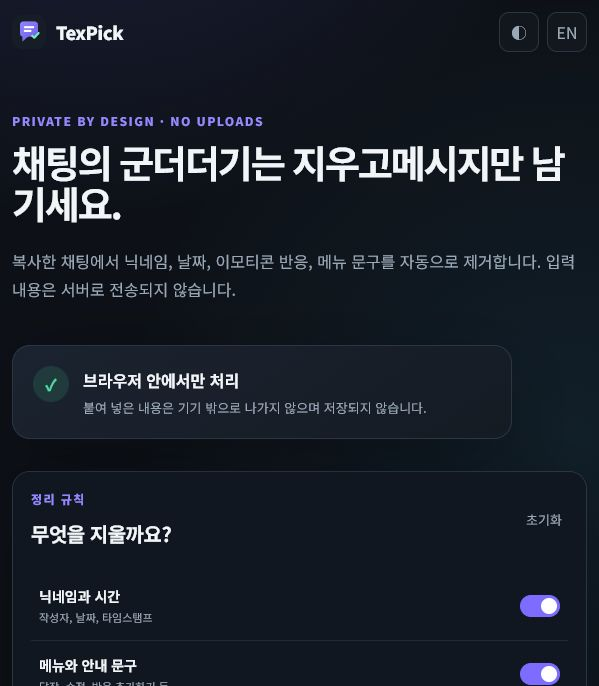

# TexPick

> Pick the text. Leave the clutter.

Remove usernames, timestamps, reactions, and interface labels from copied chats—without uploading private conversations.

[한국어 문서](docs/README.ko.md) · [Live demo](https://chatextractor.chattools.workers.dev)



## Why TexPick?

Copying a conversation from a chat app often includes metadata that is useful inside the app but noisy everywhere else: usernames, timestamps, reaction controls, reply buttons, and channel prompts.

TexPick turns that copied block into clean message text. All processing happens locally in the browser. No account, server, database, or upload is involved.

## Features

- Removes author names, dates, and timestamps from common Discord copy formats
- Removes reaction labels and message action menus
- Removes Unicode emoji, custom emoji codes, and mentions
- Supports Korean and English interfaces
- Includes custom exact-line removal rules
- Shows extraction statistics
- Copies results or downloads them as a `.txt` file
- Works on desktop and mobile
- Has no runtime dependencies and no tracking

## Privacy

TexPick does not send pasted content to a server. The extraction engine runs entirely in the user's browser.

- No analytics
- No cookies
- No database
- No chat content storage
- No third-party scripts

You can verify this directly in the source code.

## Quick start

Open `index.html` in a modern browser. No build step is required.

For local development:

```bash
python -m http.server 8080
```

Then open `http://localhost:8080`.

## Tests

The extraction engine is tested with Node's built-in test runner:

```bash
npm test
```

No package installation is required for the tests.

## Project structure

```text
.
├── assets/
│   └── logo.svg
├── docs/
│   └── README.ko.md
├── src/
│   ├── app.js
│   └── extractor.js
├── tests/
│   └── extractor.test.js
├── index.html
└── styles.css
```

## Supported formats

The current parser focuses on copied Discord conversations in Korean and English, including compact timestamp formats produced by selecting messages in the desktop client.

Other chat platforms may partially work. Contributions with anonymized copy-format samples are welcome.

## Contributing

See [CONTRIBUTING.md](CONTRIBUTING.md). Please anonymize chat samples before opening an issue or pull request.

## Roadmap

See [ROADMAP.md](ROADMAP.md) for planned platform support and product improvements.

## Trademark notice

TexPick is an independent open-source project. It is not affiliated with, endorsed by, or sponsored by Discord Inc. Discord is a trademark of Discord Inc.

## License

[MIT](LICENSE)
